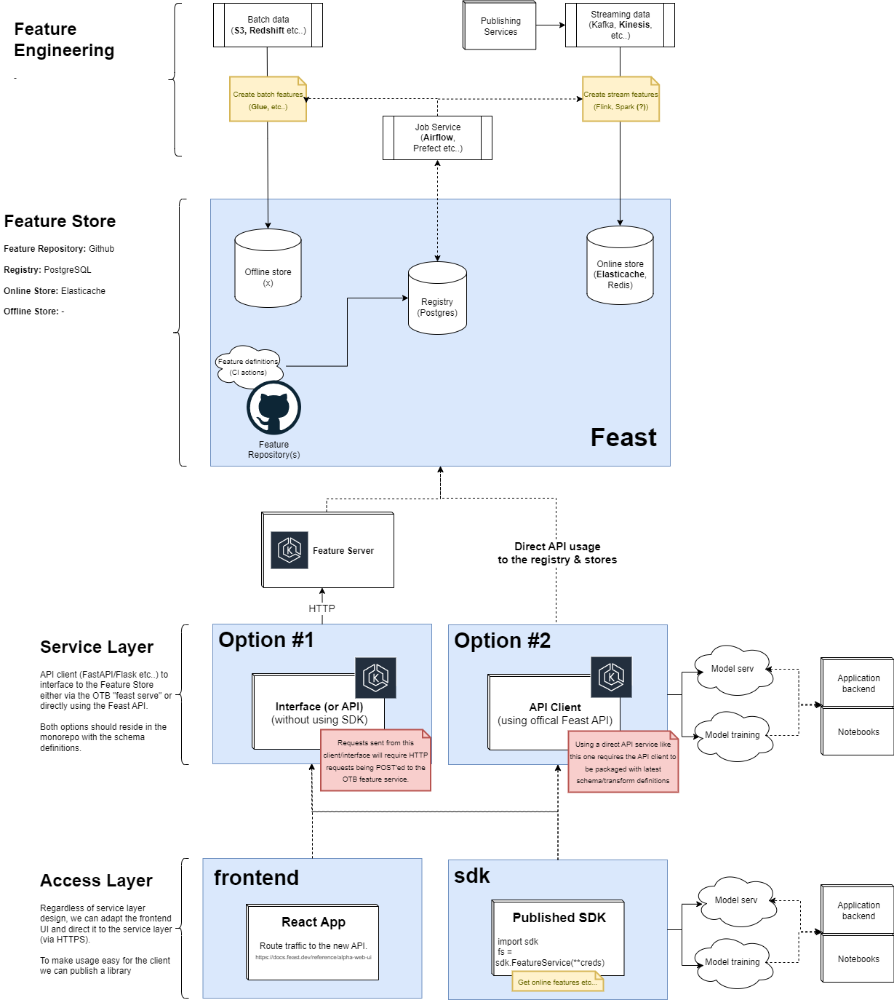

<br />
<div align="center">
  <a href="https://streamlit.io/">
    
  </a>

<h3 align="center">Feast on AWS</h3>

  <p align="center">
    A complete scalable implementation of feature store management on AWS.
    <br />
    <a href="https://feast.dev/"><strong>Feast</strong></a>
    <br />
    <br />
  </p>
</div>

<br>


## Table of Contents
- [Project Overview](#project-overview)
- [Architecture](#architecture)
- [Getting Started](#getting-started)
- [Project Structure](#project-structure)
- [Usage](#usage)
- [Development](#development)
- [Contributing](#contributing)
- [Additional Features](#additional-features)
- [Resources](#resources)
- [License](#license)

<br>

## Project Overview
The feast-aws project is an solution designed to streamline feature management in machine learning workflows using [Feast](https://feast.dev/), a popular open-source feature store, on AWS cloud infrastructure. 

The project encapsulates a full-feature lifecycle management process, from defining and storing features to serving them for ML models in production. It combines the power of Feast with the scalability and robustness of AWS, creating a versatile environment for managing and deploying features at scale.

<br>

## Architecture

Overview of the project architecture. Include a link or image of `aws_architecture.png` from the `docs` directory for a visual representation.



<br>

## Getting Started
This guide will walk you through setting up and running the feast-aws project. The project is structured to manage infrastructure using Terraform, define and store features using Feast, and provide a user interface and API server for interaction.

<br>

### Requirements
Before starting, ensure you have the following installed:

- [Git](https://git-scm.com/) for command-line interface
- [Poetry](https://python-poetry.org/) for dependency management and packaging
- [Docker](https://docs.docker.com/get-docker/) for developing, shipping, and running applications
- [Yarn](#) for the React UI
- [Terraform](#) for infastructure management

<br>

### Cloning the Repository

Start by cloning the repository to your local machine:

```bash
git clone https://github.com/jordanhoare/feast-aws.git
cd feast-aws
poetry install
```

<br>

### Setting Up Infrastructure

The project uses Terraform scripts located in the `infrastructure/aws` directory to manage AWS resources.

1. Navigate to the infrastructure directory:

   ```bash
   cd infrastructure/aws
   ```

2. Initialize Terraform:

   ```bash
   terraform init
   ```

3. Apply Terraform scripts to create resources:

   ```bash
   terraform apply
   ```

   Confirm the action in the CLI when prompted.

<br>

### Understanding Makefile Commands

The `Makefile` in the root directory contains several commands to simplify project operations:

- `plan`: Runs `feast plan` to show the planned changes to the feature store.
  
  ```bash
  make plan
  ```

- `apply`: Applies the planned changes to the feature store.

  ```bash
  make apply
  ```

- `serve`: Serves the Feast feature store for local development.

  ```bash
  make serve
  ```

- `run_server`: Runs the FastAPI server.

  ```bash
  make run_server
  ```

- `run_client`: Starts the React client application.

  ```bash
  make run_client
  ```

Each command is tailored to abstract complex CLI operations into simpler make commands, enhancing the development and deployment experience.

<br>

### Running the Project

After setting up the infrastructure and understanding the Makefile commands, you can start the various components of the project:

1. Start the FastAPI server:

   ```bash
   make run_server
   ```

2. In a separate terminal, start the React client application:

   ```bash
   make run_client
   ```

You should now have the FastAPI server, React client, and optionally the Feast UI running, ready for development and testing.

<br>

## Project Structure
Outline the structure of the project and describe the purpose of each top-level directory.

| Directory/File        | Description                                       |
|-----------------------|---------------------------------------------------|
| `infrastructure/aws`  | Terraform scripts for AWS resource management     |
| `repository`          | Library of feature declarations for Feast        |
| `server`              | FastAPI server interfacing with the Feast API    |
| `ui`                  | React frontend application                        |
| `tests`               | Test suite for the project                        |
| `Makefile`            | Commands for running modules and other operations |
| `pyproject.toml`      | Python project metadata and dependencies         |

<br>

## Resources
- Official Feast Docs: [Feast Docs](https://docs.feast.dev/)
- Official Feast API Reference: [API Reference](https://rtd.feast.dev/en/master/)
